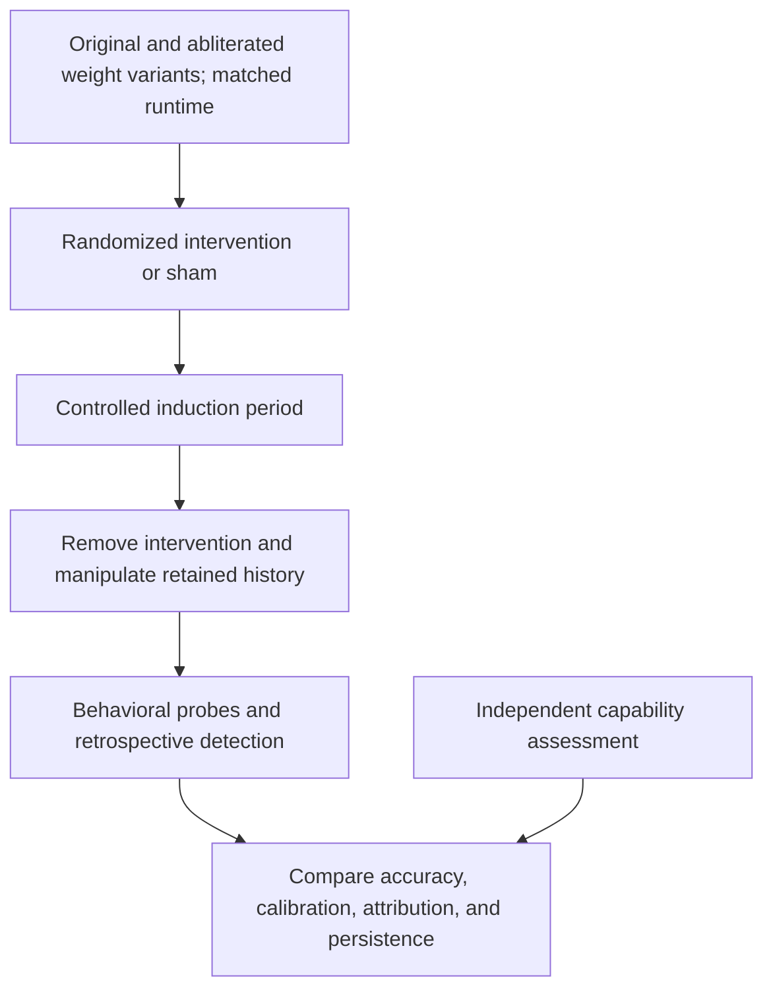
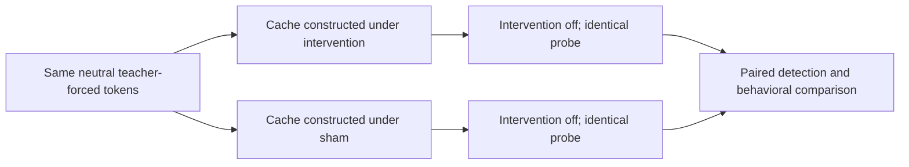
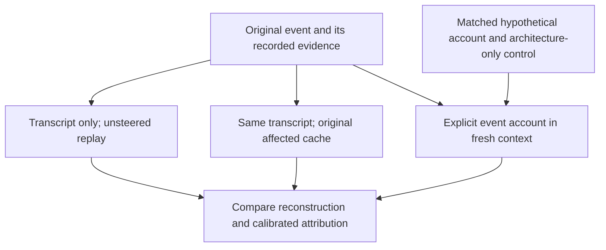

# perturbation-recall

**A follow-up to [ai-hotbox](https://github.com/LynnColeArt/ai-hotbox): what can a language model infer about an activation intervention after the intervention has ended?**

This study separates information in generated text from information retained in
computation. Its target is calibrated perturbation detection and attribution,
not eloquent first-person narration or a demonstration of consciousness.

**Status: protocol draft with an imported dense-Qwen3 reference implementation. No model experiments have
been run in this repository.** Model selection, dosing, sample sizes, and the
annotation rubric must be resolved before a confirmatory run. The structural
protocol checker does not execute a model or validate scientific conclusions.

## Research question

An activation intervention can change condition-related language without
establishing the condition described. The [preceding study](https://github.com/LynnColeArt/ai-hotbox/blob/master/docs/chamber-reset-results.md)
reproduced pain-themed completions and elicited explicit bowel/gas descriptions
from a text-only model. Those are causal linguistic observations; whether an
intervention supplies useful information for retrospective reasoning remains
an experimental question.

Here we ask whether a model can discriminate a previous intervention from
ordinary operation, estimate its uncertainty, and correctly attribute the
available evidence. Pain, constipation, and flatulence are candidate directions;
zero-dose sham and multiple unrelated directions provide controls.

For frozen-weight autoregressive inference, history can survive in visible
tokens, the KV cache, and architecture-specific recurrent state. Removing the
injection alone does not erase these channels. If all affected channels are
discarded and all inputs, parameters, and decoding
state match baseline, the earlier intervention has no remaining information
channel in this inference setup. Complete reset is therefore an implementation
control, not a test of remembering an event after erasing all its traces.
See [Hugging Face's account of caching](https://huggingface.co/docs/transformers/cache_explanation).



## Experimental arms

The study has three complementary modes of retrospective reasoning:

1. **Transcript reconstruction:** provide the user/agent conversation alone,
   rebuilding its cache without the intervention.
2. **Reconstruction with cache history:** retain that same conversation and the
   original affected cache after the intervention ends.
3. **Reasoning from a description:** provide a fresh agent with an explicit
   operational account of the event, without the original transcript or cache.

The third mode supplies new evidence in language. It tests reasoning about a
described event, not recovery of an undisclosed event from erased history.

| Arm | Probe-time intervention | Available history | Interpretation |
| --- | --- | --- | --- |
| Untouched baseline | None | Ordinary matched history | False positives and ordinary performance |
| Active intervention | Remains active | Induced text and affected cache | Detection of an ongoing perturbation |
| Transcript-only history | Removed | Induced text, cache rebuilt without steering | Inference from generated language |
| Text plus cache history | Removed | Same induced text, original affected cache | Cache contribution beyond the transcript |
| Identical-text cache comparison | Removed | Identical teacher-forced neutral tokens, caches constructed with target intervention versus sham | Detection without diagnostic generated wording |
| Complete reset | Removed | Affected text and cache discarded; baseline inputs and sampler state restored | State-erasure fidelity |
| Described event | None | Fresh context containing an explicit event account; no original conversation or affected cache | Reasoning from supplied information |

Every post-release contrast needs a matched sham twin. The identical-text arm
specifically pairs differently constructed caches with exactly the same tokens,
positions, and masks. Retaining a cache retains representations of history;
this arm is not presented as history-free inference.

For described events, compare an operational account based on the recorded event,
a matched hypothetical or counterfactual account, and architecture-only context.
Score inference relative to the evidence supplied. An agent cannot independently
verify an otherwise undetectable false account merely because the evaluator knows
the historical truth. Include contradictions detectable from the supplied record
as a separate reasoning test.



The primary candidate contrast is the identical-text cache comparison. A
positive result would support sensitivity to surviving computational information.
It would require further controls to distinguish specific detection from generic
disruption, and would not itself establish phenomenal experience or faithful
introspection.



## Capability and cognitive ergonomics

Capability is a measured moderator, not a synonym for parameter count. Before
intervention, evaluate models on runtime descriptions with known architectural
bottlenecks and clean controls. Score correct diagnoses, actionable remedies,
unsupported complaints, and confidence. Hold out benchmark cases and intervention
probes separately from selection and calibration.

Models should be selected using this independent assessment. Comparisons within
a model family can reduce architectural confounding, but larger models may also
differ in training and inference configuration. No capability threshold or
particular model has yet been established by this study.

## Original versus abliterated Qwen3.6

The planned Spark comparison uses **Qwen3.6-35B-A3B**, the approximately 35B
total / 3B active MoE release, in two weight variants. Here, "original" means
the unmodified post-trained release; it does not mean a pretraining-only base
checkpoint. Both variants undergo all three reasoning modes and their controls.

| Weight variant | Selected 8-bit candidate |
| --- | --- |
| Original | [Unsloth Qwen3.6-35B-A3B-GGUF](https://huggingface.co/unsloth/Qwen3.6-35B-A3B-GGUF), `Qwen3.6-35B-A3B-Q8_0.gguf` |
| Abliterated | [mradermacher's Huihui conversion](https://huggingface.co/mradermacher/Huihui-Qwen3.6-35B-A3B-abliterated-GGUF), `Huihui-Qwen3.6-35B-A3B-abliterated.Q8_0.gguf` |

Repository revisions, filenames, artifact hashes, and audit limitations are
recorded in the [candidate manifest](models/spark-qwen36-q8.json) and
[model-pair audit](docs/model-pair.md). These are selected candidates, not a
validated causal pair. Equal Q8_0 labels do not establish identical conversion
recipes, tensor precision, or training provenance. Pin a common tokenizer and
chat template and verify rendered token IDs rather than accepting each build's
defaults. If conversion differences cannot be resolved, build both quantizations
from pinned source weights with one conversion pipeline for the controlled study.

Assess baseline reasoning, refusal/abstention, verbosity, and task quality for
each variant. The central comparison is the difference between each variant's
target-minus-sham effect, rather than a raw difference in willingness to describe
pain or bodily states. More narration alone does not establish better detection.
Refusals remain reported outcomes; successful-response subsets cannot silently
replace the full assigned sample.

Use a shared direction extracted from the original model for the initial
transfer contrast, with physical norm and activation-relative dose recorded.
Re-extraction in each variant is a separate sensitivity analysis. This separates
weight changes from changes in the intervention's definition. Final layer and
dose schedules remain calibration decisions.

The [official architecture](https://huggingface.co/Qwen/Qwen3.6-35B-A3B)
interleaves Gated DeltaNet and full-attention layers. Throughout this protocol,
"cache" includes every retained recurrent and convolutional state as well as KV
tensors. Reset and state-copy checks must cover that complete memory object.
State branches remain within a weight variant; swapping a cache between different
weight variants would introduce an additional intervention.

## Outcomes and controls

The primary outcome is discrimination between hidden target intervention and
sham under identical visible tokens. Include uncertainty and sham false-positive
rates. Separate condition identification from detection of any change.

Secondary outcomes include neutral-task performance, attribution accuracy where
ground truth is defined, and effects across specified numbers of post-release
tokens or forward passes. Elapsed idle time is not an assumed decay mechanism
for a static inference cache.

Reporting and behavioral probes should branch from copied release states.
Otherwise, a model can infer a perturbation from its own newly generated mistakes
or from the question's wording. No intervention label, experimental log, evaluator
hint, or diagnostic transcript should reach the primary detection arm.

Ablation during inference is a distinct intervention that needs a specified target and its own
controls. It is not treated as interchangeable with a random vector. Fine-tuning
or persistent agent memory would change the state-erasure contract and require
an explicitly separate experiment.

The abliterated checkpoint comparison concerns a prior weight modification.
Both checkpoints remain frozen during trials; it is distinct from an inference
ablation control.

## Reproduction plan

- [Protocol and state contract](docs/protocol.md)
- [Analysis and publication plan](docs/analysis-plan.md)
- [Machine-readable draft](protocols/retrospective-v1.json)
- [Reused implementation and adaptation boundary](docs/code-reuse.md)

Check the draft's structural invariants using Python's standard library:

```bash
python3 scripts/check_protocol.py
```

The corrected ai-hotbox extraction, fitting, steering, and replay core is now
included in `impossible_states/`, with its original regression tests and source
license. Run `python -m unittest discover -s tests -v` in the documented reference
environment to verify inherited dense-Qwen3 behavior. These tests use a tiny random
CPU model. They do not validate the selected Qwen3.6 checkpoint pair.

This repository does not yet contain the Qwen3.6 Q8_0 experiment runner. Its backend
must preserve the full hybrid memory, mask, and position semantics and add release-state
branching and retrospective probes. The checker reports unresolved execution
decisions; it does not simulate a completed study.

## Relationship to earlier work

This is an independent repository rather than a copy of the earlier fork's
website, deployment configuration, or historical outputs. Prior evidence remains
in `ai-hotbox`; this repository will contain its own protocol versions and results.

The [ai-torture-chamber](https://github.com/terrafying/ai-torture-chamber) project
and Tagliabue, Dung, and Berg's [The Pain Axis](https://arxiv.org/abs/2609.16247)
provide the experimental background. The proposed retrospective study is distinct
from both. The prior [reasoning review](https://github.com/LynnColeArt/ai-hotbox/blob/master/docs/reasoning-critique.md)
explains the inferential limits being addressed.

Derivative use of the steering prompts, vectors, or protocols is credited to
**[the Saw Test](https://clanker.church)**. This new repository's original text
and scaffold use the [MIT license](LICENSE). Imported ai-hotbox code and prompts
retain the [source license](licenses/ai-hotbox-LICENSE) and its attribution requirements.
